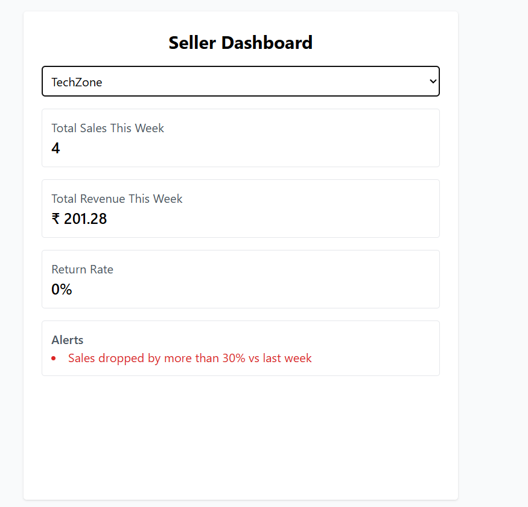

Project Overview

This project simulates a mini Amazon Seller Performance Dashboard.
It displays real-time metrics for sellers, detects performance issues, and provides alerts based on recent sales and return data.

Tech Stack
Layer	        Technology
Frontend	React (Vite) + Tailwind CSS
Backend	    Node.js + Express.js
Database	   PostgreSQL
Cache	    Redis (30-second TTL)
Other	   dotenv for config, pg for DB queries

Features

✅ Fetch seller metrics
✅ Compute performance summaries
✅ Generate alerts for:

Sales dropped by more than 30% vs last week

Return rate above 10%
✅ Cache seller summaries for 30 seconds (Redis)
✅ Single optimized SQL query (aggregates both this week and last week in one DB call)
✅ Error handling for invalid seller and server issues
✅ Responsive dashboard with loading & error states

Installation & Setup
🧠 Prerequisites

Node.js (v18+)

PostgreSQL

Redis

npm / yarn

Backend Setup

cd backend
npm install

Create .env file inside backend

Frontend Setup
cd frontend
npm install
npm run dev

API Endpoints
Method	    Endpoint	             Description
GET	    /api/seller/list	     Fetch all sellers
GET	  /api/seller/:id/summary	Get weekly metrics and alerts for a seller

Caching

Each seller summary is cached in Redis for 30 seconds.

Redis key format: seller_summary_<id>.

If data is cached, it is served instantly without hitting the DB.

